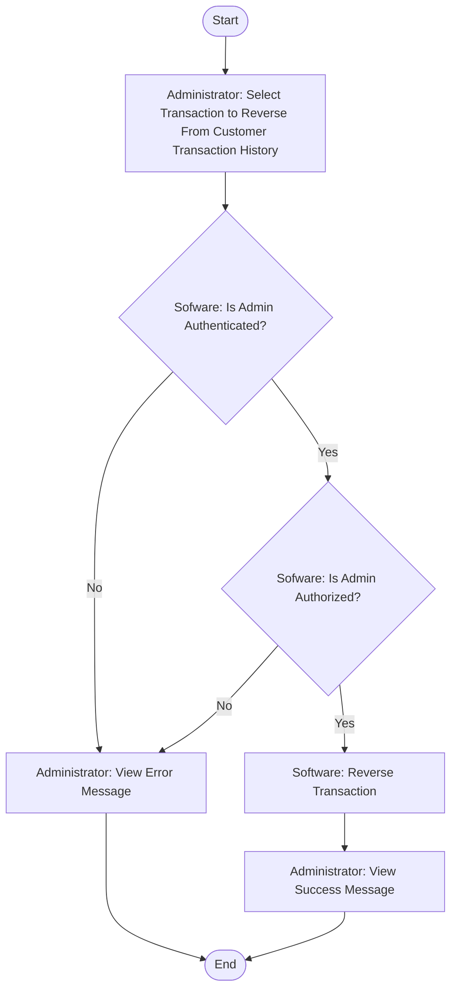

```mermaid
graph TD
    Start(["Start"])

    %% Admin Actions
    AdminSelectTransaction["Administrator: Select Transaction to Reverse From Customer Transaction History"]
    AdminDisplayError["Administrator: View Error Message"]
    AdminDisplaySuccess["Administrator: View Success Message"]

    %% Software Decisions
    Decision1{"Sofware: Is Admin Authenticated?"}
    Decision2{"Sofware: Is Admin Authorized?"}
    ServerReverseTransaction["Software: Reverse Transaction"]

    End(["End"])

    Start --> AdminSelectTransaction
    AdminSelectTransaction --> Decision1

    Decision1 -- Yes --> Decision2
    Decision1 -- No --> AdminDisplayError

    Decision2 -- Yes --> ServerReverseTransaction
    Decision2 -- No --> AdminDisplayError

    ServerReverseTransaction --> AdminDisplaySuccess

    AdminDisplayError --> End
    AdminDisplaySuccess --> End

```