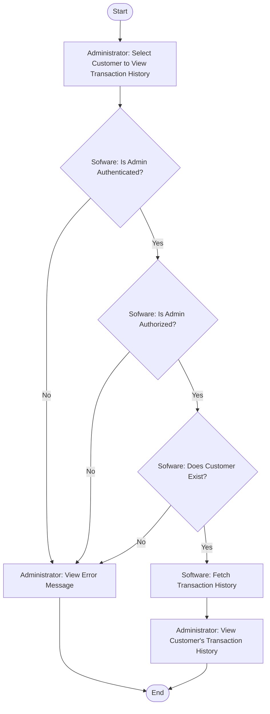

```mermaid
graph TD
    Start(["Start"])

    %% Admin Actions
    AdminSelectCustomer["Administrator: Select Customer to View Transaction History"]
    AdminDisplayError["Administrator: View Error Message"]
    AdminDisplayTransactions["Administrator: View Customer's Transaction History"]

    %% Software Decisions
    Decision1{"Sofware: Is Admin Authenticated?"}
    Decision2{"Sofware: Is Admin Authorized?"}
    Decision3{"Sofware: Does Customer Exist?"}
    ServerFetchTransactionHistory["Software: Fetch Transaction History"]

    End(["End"])

    Start --> AdminSelectCustomer
    AdminSelectCustomer --> Decision1

    Decision1 -- Yes --> Decision2
    Decision1 -- No --> AdminDisplayError

    Decision2 -- Yes --> Decision3
    Decision2 -- No --> AdminDisplayError

    Decision3 -- Yes --> ServerFetchTransactionHistory
    Decision3 -- No --> AdminDisplayError

    ServerFetchTransactionHistory --> AdminDisplayTransactions
    
    AdminDisplayError --> End
    AdminDisplayTransactions --> End

```