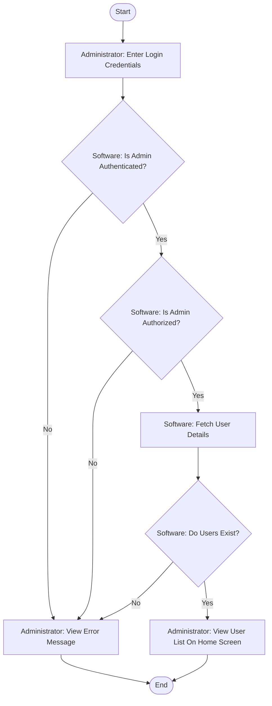

```mermaid
graph TD
    Start(["Start"])

    %% Admin Actions
    AdminEnterCredentials["Administrator: Enter Login Credentials"]
    AdminDisplayError["Administrator: View Error Message"]
    AdminDisplayUsers["Administrator: View User List On Home Screen"]

    %% Software Decisions
    Decision1{"Software: Is Admin Authenticated?"}
    Decision2{"Software: Is Admin Authorized?"}
    Decision3{"Software: Do Users Exist?"}
    ServerFetchUserDetails["Software: Fetch User Details"]

    End(["End"])

    Start --> AdminEnterCredentials
    AdminEnterCredentials --> Decision1

    Decision1 -- Yes --> Decision2
    Decision1 -- No --> AdminDisplayError

    Decision2 -- Yes --> ServerFetchUserDetails
    Decision2 -- No --> AdminDisplayError

    ServerFetchUserDetails --> Decision3
    Decision3 -- Yes --> AdminDisplayUsers
    Decision3 -- No --> AdminDisplayError

    AdminDisplayError --> End
    AdminDisplayUsers --> End

```