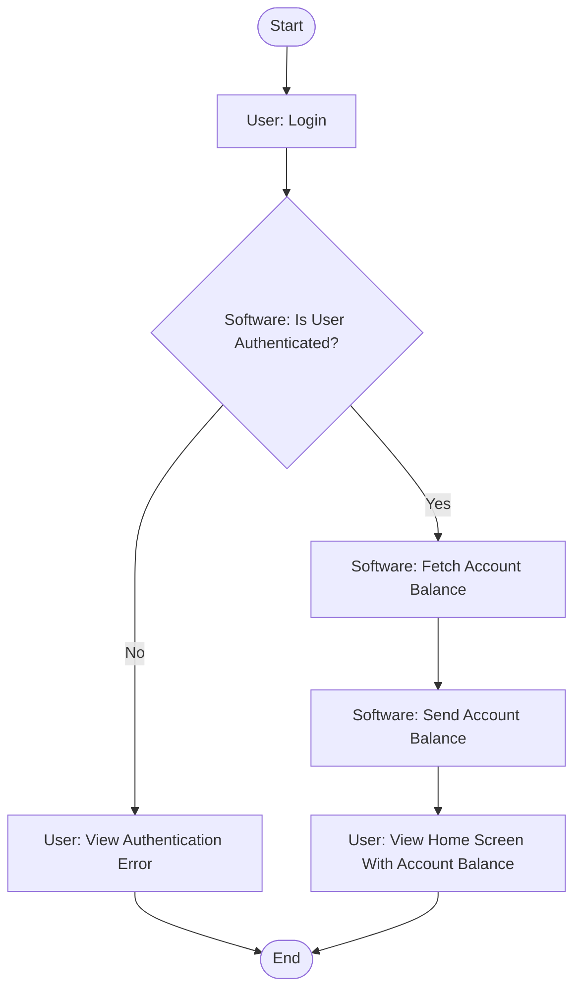

```mermaid
graph TD
    Start(["Start"])

    %% User Actions
    UserCheckAuth["User: Login"]
    UserDisplayError["User: View Authentication Error"]
    UserDisplayBalance["User: View Home Screen With Account Balance"]

    %% Software Actions
    Decision1{"Software: Is User Authenticated?"}
    ServerFetchBalance["Software: Fetch Account Balance"]
    ServerSendBalance["Software: Send Account Balance"]

    End(["End"])

    Start --> UserCheckAuth
    UserCheckAuth --> Decision1

    Decision1 -- Yes --> ServerFetchBalance
    Decision1 -- No --> UserDisplayError
    UserDisplayError --> End

    ServerFetchBalance --> ServerSendBalance
    ServerSendBalance --> UserDisplayBalance
    UserDisplayBalance --> End

```