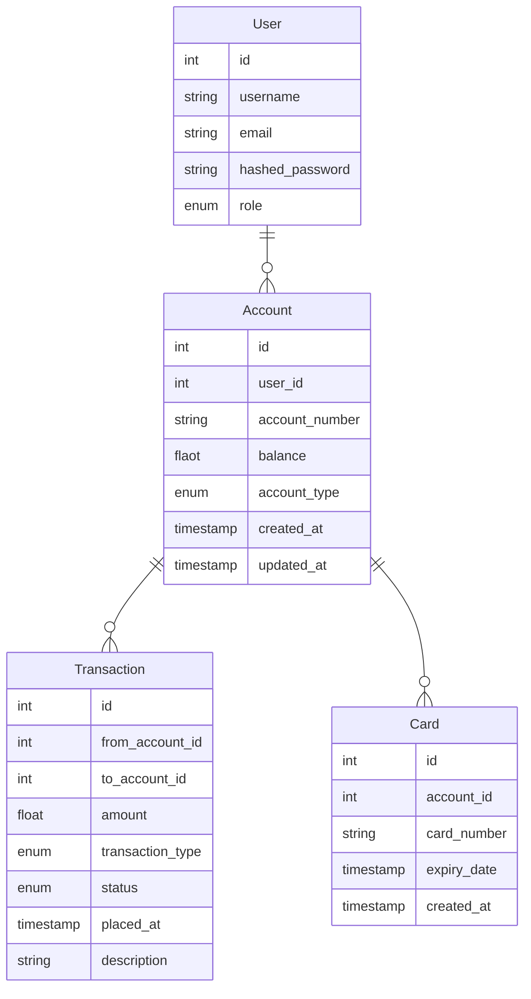

```mermaid
erDiagram
    
    User {
        int id
        string username
        string email
        string hashed_password
        enum role
    }

    Account {
        int id
        int user_id
        string account_number
        flaot balance
        enum account_type
        timestamp created_at
        timestamp updated_at
    }

    Transaction {
        int id
        int from_account_id
        int to_account_id
        float amount
        enum transaction_type
        enum status
        timestamp placed_at
        string description
    }

    Card {
        int id
        int account_id
        string card_number
        timestamp expiry_date
        timestamp created_at
    }

    User ||--o{ Account : ""
    Account ||--o{ Transaction : ""
    Account ||--o{ Card : ""

```