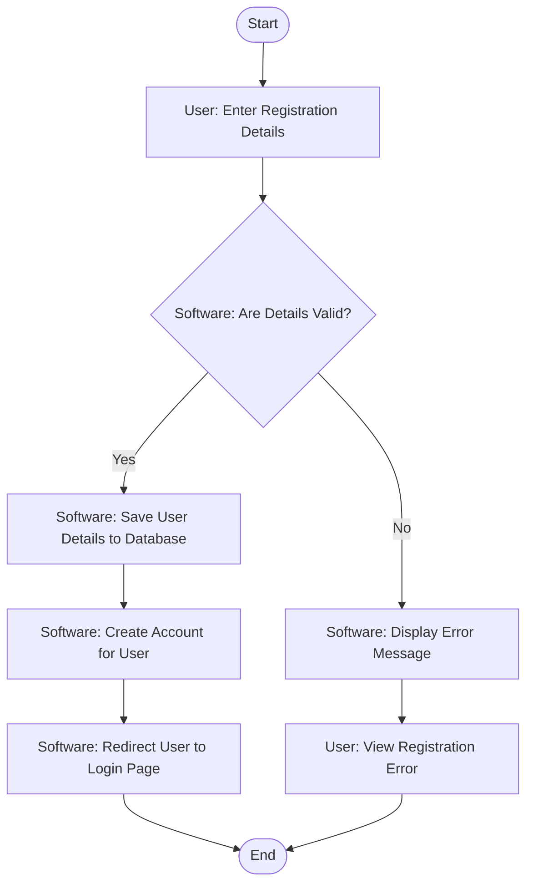

```mermaid
graph TD
    Start(["Start"])

    %% User Actions
    UserEnterDetails["User: Enter Registration Details"]
    UserDisplayError["User: View Registration Error"]
    SoftwareRedirectToLogin["Software: Redirect User to Login Page"]

    %% Software Actions
    ValidateDetails{"Software: Are Details Valid?"}
    SaveToDatabase["Software: Save User Details to Database"]
    SendConfirmation["Software: Create Account for User"]
    RegistrationError["Software: Display Error Message"]

    End(["End"])

    %% Flow
    Start --> UserEnterDetails
    UserEnterDetails --> ValidateDetails

    ValidateDetails -- Yes --> SaveToDatabase
    SaveToDatabase --> SendConfirmation
    SendConfirmation --> SoftwareRedirectToLogin
    SoftwareRedirectToLogin --> End

    ValidateDetails -- No --> RegistrationError
    RegistrationError --> UserDisplayError
    UserDisplayError --> End
```