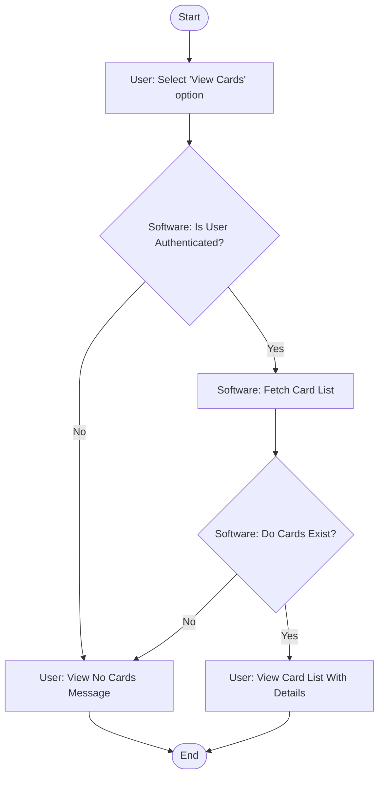

```mermaid
graph TD
    Start(["Start"])

    %% User Actions
    UserSelectViewCards["User: Select 'View Cards' option"]
    UserDisplayNoCards["User: View No Cards Message"]
    UserDisplayCards["User: View Card List With Details"]

    %% Software Actions
    Decision1{"Software: Is User Authenticated?"}
    Decision2{"Software: Do Cards Exist?"}
    ServerFetchCardList["Software: Fetch Card List"]

    End(["End"])

    Start --> UserSelectViewCards
    UserSelectViewCards --> Decision1

    Decision1 -- Yes --> ServerFetchCardList
    Decision1 -- No --> UserDisplayNoCards

    ServerFetchCardList --> Decision2
    Decision2 -- Yes --> UserDisplayCards
    Decision2 -- No --> UserDisplayNoCards

    UserDisplayNoCards --> End
    UserDisplayCards --> End

```