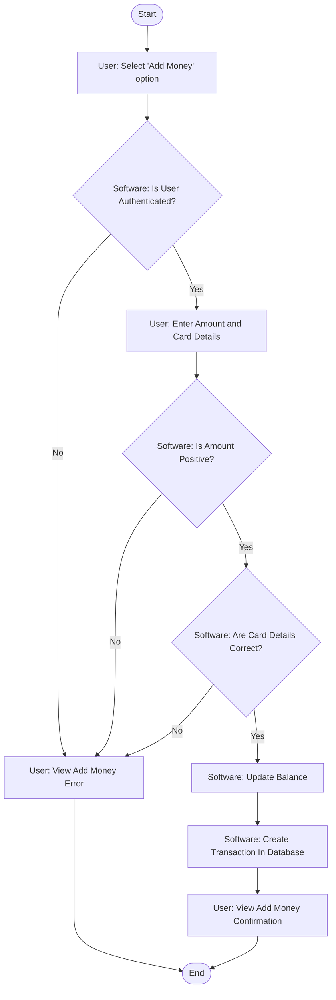

```mermaid
graph TD
    Start(["Start"])

    %% User Actions
    UserSelectAddMoney["User: Select 'Add Money' option"]
    UserEnterAmount["User: Enter Amount and Card Details"]
    UserDisplayError["User: View Add Money Error"]
    UserDisplayConfirmation["User: View Add Money Confirmation"]

    %% Software Actions
    Decision1{"Software: Is User Authenticated?"}
    Decision2{"Software: Is Amount Positive?"}
    Decision3{"Software: Are Card Details Correct?"}
    ServerUpdateBalance["Software: Update Balance"]
    ServerCreateTransaction["Software: Create Transaction In Database"]

    End(["End"])

    Start --> UserSelectAddMoney
    UserSelectAddMoney --> Decision1

    Decision1 -- Yes --> UserEnterAmount
    Decision1 -- No --> UserDisplayError

    UserEnterAmount --> Decision2
    Decision2 -- Yes --> Decision3
    Decision2 -- No --> UserDisplayError

    Decision3 -- Yes --> ServerUpdateBalance
    Decision3 -- No --> UserDisplayError
    UserDisplayError --> End

    ServerUpdateBalance --> ServerCreateTransaction
    ServerCreateTransaction --> UserDisplayConfirmation
    UserDisplayConfirmation --> End

```