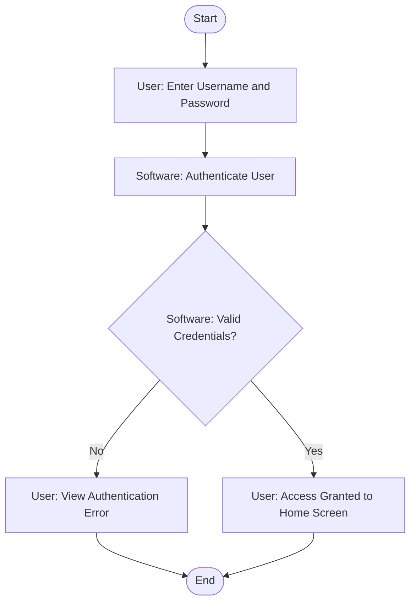

```mermaid
graph TD
    Start(["Start"])

    %% User Actions
    UserEnterCredentials["User: Enter Username and Password"]
    UserDisplayError["User: View Authentication Error"]
    UserAccessGranted["User: Access Granted to Home Screen"]

    %% Software Actions
    Decision1{"Software: Valid Credentials?"}
    ServerAuthenticate["Software: Authenticate User"]

    End(["End"])

    Start --> UserEnterCredentials
    UserEnterCredentials --> ServerAuthenticate
    ServerAuthenticate --> Decision1

    Decision1 -- Yes --> UserAccessGranted
    Decision1 -- No --> UserDisplayError
    UserDisplayError --> End

    UserAccessGranted --> End

```