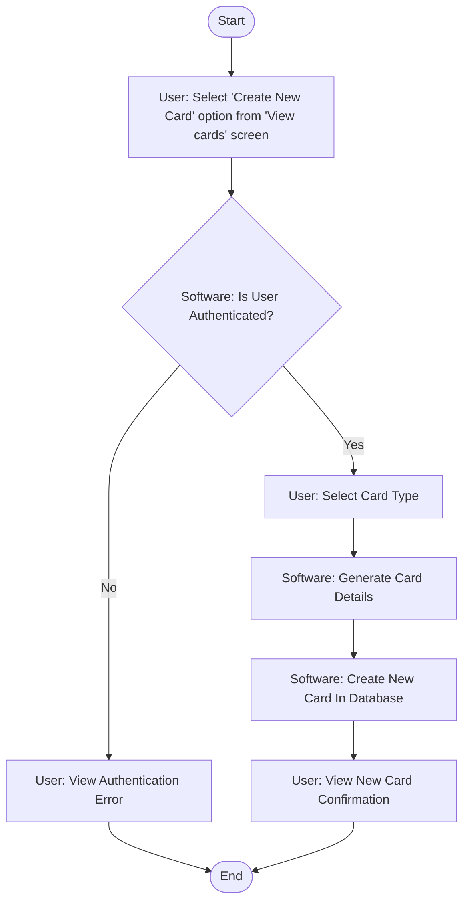

```mermaid
graph TD
    Start(["Start"])

    %% User Actions
    UserSelectCreateCard["User: Select 'Create New Card' option from 'View cards' screen"]
    UserSelectCardType["User: Select Card Type"]
    UserDisplayError["User: View Authentication Error"]
    UserDisplayConfirmation["User: View New Card Confirmation"]

    %% Software Actions
    Decision1{"Software: Is User Authenticated?"}
    ServerGenerateCardDetails["Software: Generate Card Details"]
    ServerCreateNewCardInDatabase["Software: Create New Card In Database"]

    End(["End"])

    Start --> UserSelectCreateCard
    UserSelectCreateCard --> Decision1

    Decision1 -- Yes --> UserSelectCardType
    Decision1 -- No --> UserDisplayError
    UserDisplayError --> End

    UserSelectCardType --> ServerGenerateCardDetails

    ServerGenerateCardDetails --> ServerCreateNewCardInDatabase
    ServerCreateNewCardInDatabase --> UserDisplayConfirmation
    UserDisplayConfirmation --> End
```