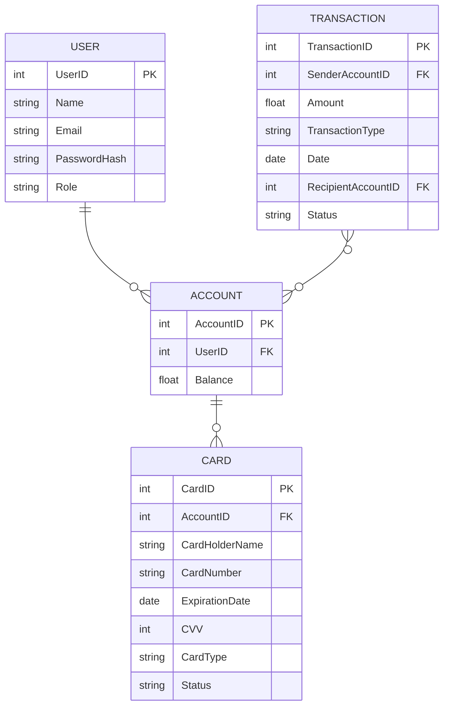

```mermaid
erDiagram
    %% Entities and Attributes
    USER {
        int UserID PK
        string Name
        string Email
        string PasswordHash
        string Role
    }

    ACCOUNT {
        int AccountID PK
        int UserID FK
        float Balance
    }

    TRANSACTION {
        int TransactionID PK
        int SenderAccountID FK
        float Amount
        string TransactionType
        date Date
        int RecipientAccountID FK
        string Status
    }

    CARD {
        int CardID PK
        int AccountID FK
        string CardHolderName
        string CardNumber
        date ExpirationDate
        int CVV
        string CardType
        string Status
    }

    %% Relationships
    USER ||--o{ ACCOUNT : ""
    ACCOUNT ||--o{ CARD : ""
    TRANSACTION }o--o{ ACCOUNT : ""

```