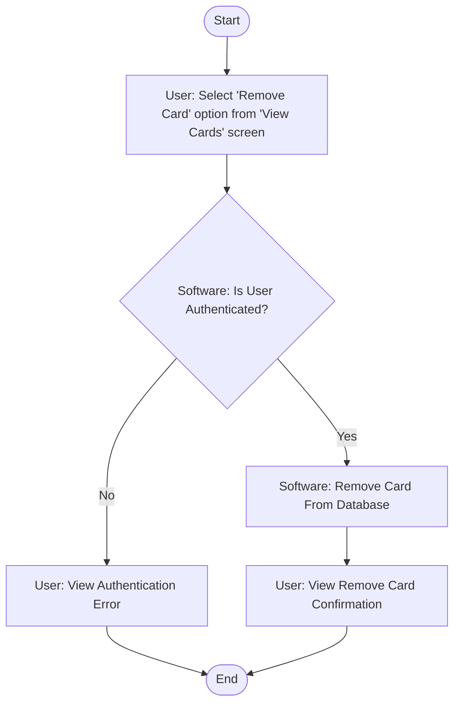

```mermaid
graph TD
    Start(["Start"])

    %% User Actions
    UserSelectRemoveCard["User: Select 'Remove Card' option from 'View Cards' screen"]
    UserDisplayError["User: View Authentication Error"]
    UserDisplayConfirmation["User: View Remove Card Confirmation"]

    %% Software Actions
    Decision1{"Software: Is User Authenticated?"}
    ServerRemoveCardFromDatabase["Software: Remove Card From Database"]

    End(["End"])

    Start --> UserSelectRemoveCard
    UserSelectRemoveCard --> Decision1

    Decision1 -- Yes --> ServerRemoveCardFromDatabase
    Decision1 -- No --> UserDisplayError
    UserDisplayError --> End


    ServerRemoveCardFromDatabase --> UserDisplayConfirmation
    UserDisplayConfirmation --> End

```