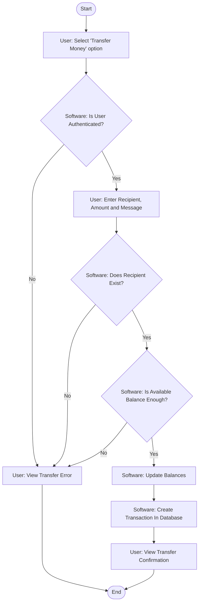

```mermaid
graph TD
    Start(["Start"])

    %% User Actions
    UserSelectTransfer["User: Select 'Transfer Money' option"]
    UserEnterDetails["User: Enter Recipient, Amount and Message"]
    UserDisplayError["User: View Transfer Error"]
    UserDisplayConfirmation["User: View Transfer Confirmation"]

    %% Software Actions
    Decision1{"Software: Is User Authenticated?"}
    Decision2{"Software: Does Recipient Exist?"}
    Decision3{"Software: Is Available Balance Enough?"}
    ServerUpdateBalances["Software: Update Balances"]
    ServerCreateTransaction["Software: Create Transaction In Database"]

    End(["End"])

    Start --> UserSelectTransfer
    UserSelectTransfer --> Decision1

    Decision1 -- Yes --> UserEnterDetails
    Decision1 -- No --> UserDisplayError

    UserEnterDetails --> Decision2
    Decision2 -- Yes --> Decision3
    Decision2 -- No --> UserDisplayError

    Decision3 -- Yes --> ServerUpdateBalances
    Decision3 -- No --> UserDisplayError

    ServerUpdateBalances --> ServerCreateTransaction
    ServerCreateTransaction --> UserDisplayConfirmation
    
    UserDisplayError --> End
    UserDisplayConfirmation --> End

```