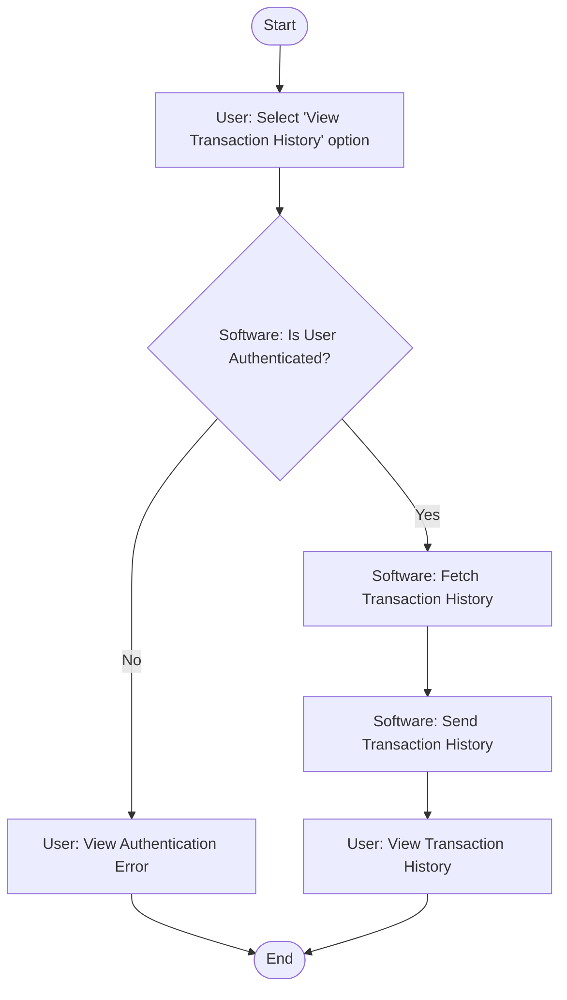

```mermaid
graph TD
    Start(["Start"])

    %% User Actions
    UserCheckAuth["User: Select 'View Transaction History' option"]
    UserDisplayError["User: View Authentication Error"]
    UserDisplayHistory["User: View Transaction History"]

    %% Software Actions
    Decision1{"Software: Is User Authenticated?"}
    ServerFetchHistory["Software: Fetch Transaction History"]
    ServerSendHistory["Software: Send Transaction History"]

    End(["End"])

    Start --> UserCheckAuth
    UserCheckAuth --> Decision1

    Decision1 -- Yes --> ServerFetchHistory
    Decision1 -- No --> UserDisplayError
    UserDisplayError --> End

    ServerFetchHistory --> ServerSendHistory
    ServerSendHistory --> UserDisplayHistory
    UserDisplayHistory --> End

```